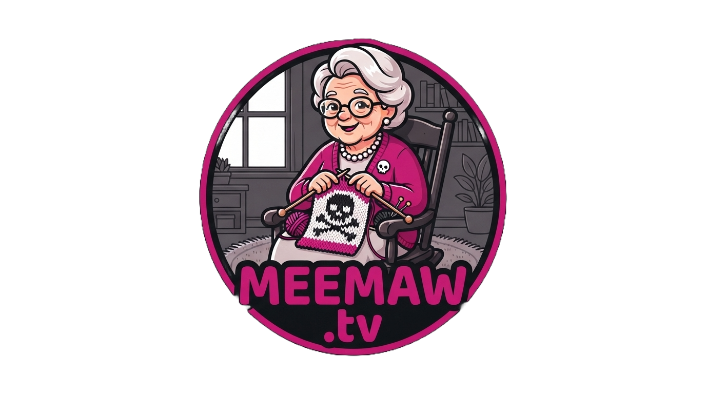

<p align="center">
  
</p>

<p align="center">
  <b>A private, self-hosted streaming app for your household.</b><br>
  Bring your own accounts; run it for the people you love.
</p>

<!-- Screenshot placeholder: browse page (billboard + rows) goes here once a deploy with test data exists. -->

---

## What it is

Meemaw.tv is the streaming interface everyone already knows (the hero billboard, the poster rows, the hover cards, the detail modal, the dark full-screen player), recolored pink-on-black and pointed at accounts you bring: [TMDB](https://www.themoviedb.org/) for metadata, your own [Real-Debrid](https://real-debrid.com/) account (via Torrentio) for streams, and [Supabase](https://supabase.com/) for sign-in and per-person state. You deploy it yourself, create a handful of users by hand, and hand out the address.

It's built for non-technical viewers. A decade of mainstream streaming apps has already trained everyone on this exact interface, so the kindest thing to build is the one that behaves the way they expect: same layout, same buttons, same timings. If your least-technical household member can't use it unassisted, it's broken. That's why "improvements" to the UI are deliberately off the table ([docs/reference/ui-fidelity.md](docs/reference/ui-fidelity.md)) and why the recorded departures from the familiar pattern are few and on purpose.

There are no signups, and that's the product. This is a closed household app: you create accounts by hand in the Supabase dashboard, signups stay disabled, and nobody "joins". If you want a public streaming service, this is not it, and it never will be.

Documentation starts at [docs/README.md](docs/README.md): guides for viewers, operators, developers, and contributors.

## What it has

- Browse pages with a hero billboard and curated poster rows (Movies / TV / home)
- Hover cards and a full detail modal with seasons and episodes
- Search, My List, and Continue Watching, kept per person in Supabase
- A full-screen player: seekbar with hover time preview, volume, next-episode, back-to-browse
- **Switch Streams**, a manual stream picker in the player for when the automatic choice disappoints (a deliberate departure; mainstream apps give you no such control)
- In-app password change (no email round-trips)
- A "Who's watching?" greeting, one profile per person

### What it deliberately doesn't have

- **Signups.** By design; see above.
- **Subtitles.** An open decision still being weighed, not an oversight.
- **Trailers.** Dropped; embedded YouTube can show ads in the middle of your cozy evening.
- **Multi-profile switching.** One profile per signed-in user, because households here sign in as themselves.

Each of these is a decision, not a gap. If you're about to propose adding one back, read the scope rules in [CONTRIBUTING.md](CONTRIBUTING.md) first. They exist precisely for this conversation.

## How it works

The viewer's browser talks only to your Next.js deployment, Supabase (session), TMDB's image CDN, and the final stream URL. Everything else happens server-side: TMDB lookups (cached), stream resolution through Torrentio's Real-Debrid-configured endpoint, and Supabase queries behind row-level security. When a title resolves, the video bytes flow directly from Real-Debrid's CDN to the browser's `<video>` element. Your server never proxies video traffic.

Full picture, request flows, and the security model: [docs/architecture.md](docs/architecture.md). The stream pipeline (TMDB ID to playable URL) is documented step by step in [docs/reference/stream-resolution.md](docs/reference/stream-resolution.md).

## Running your own

The short version is below. The expanded walkthrough, including day-to-day operation once you're live, is [docs/guides/self-hosting.md](docs/guides/self-hosting.md).

### Prerequisites

- **Node.js** (current LTS) and npm
- A **Supabase** account (free tier is fine)
- A **TMDB** account (free)
- A **Real-Debrid** account (paid; the one thing that costs money)
- Optionally **Vercel** for hosting (free tier is fine; any Node host works)
- Viewers on **Chrome or Firefox**. Playback is direct play (often MKV); Safari and iOS can't play these streams ([docs/reference/stream-resolution.md](docs/reference/stream-resolution.md)).

### 1. Clone and install

```bash
git clone <your-fork-or-clone-url> meemaw-tv
cd meemaw-tv
npm install
```

### 2. Supabase: sign-in and household state

All of this happens in the Supabase dashboard; the app never needs the Supabase CLI or the secret key. Full detail with the exact SQL: [docs/reference/supabase.md](docs/reference/supabase.md).

1. **Create a project.** Pick the region nearest your viewers and store the database password somewhere safe.
2. **Disable signups.** Authentication, then Sign In / Providers, then Email: turn off "Allow new users to sign up" and "Confirm email". This is the closed-household design, not a hardening step you can skip.
3. **Create your users by hand.** Authentication, then Users, then "Add user": email and password, with "Auto confirm" on, one per household member. Pick memorable but strong passwords; each person types theirs once per device.
4. **Run the schema.** SQL Editor: paste the schema from [docs/reference/supabase.md](docs/reference/supabase.md) (profiles, My List, watch progress, all with row-level security) and run it.
5. **Insert profile rows.** One per user, with the display name the app should greet them with. The insert statement is in the same doc; the UUIDs come from Authentication, then Users.
6. **Leave sessions long-lived.** Authentication, then Sessions: keep time-boxing and inactivity timeouts off (the defaults). Sessions here are meant to live for weeks, so people sign in once per device.
7. **Keep "Secure password change" off** (its default, on the email provider). The in-app password-change flow depends on it staying off. Turn it on and Supabase demands an emailed re-authentication, which is exactly what a household app avoids.
8. **Copy the keys.** Project Settings, then API: the Project URL and the **publishable** key. You never need the secret key.

### 3. TMDB: metadata

Create a TMDB account, then: Settings, API, request an API key for personal use. Copy the **API Read Access Token**, the long JWT, not the short "API Key". Details: [docs/reference/tmdb.md](docs/reference/tmdb.md).

### 4. Real-Debrid and Torrentio: streams

The app resolves streams through Torrentio's Real-Debrid-configured endpoint, driven by one environment variable, `TORRENTIO_CONFIG`. In short: get your Real-Debrid API key, open Torrentio's configure page, pick quality filters and paste the key, and `TORRENTIO_CONFIG` is the config segment of the install link it generates. The full step-by-step lives in [.env.example](.env.example); follow it there.

The whole `TORRENTIO_CONFIG` value embeds your Real-Debrid API key, so treat it as a secret on par with the key itself: server-side only, never committed, never pasted into an issue.

### 5. Run it

```bash
cp .env.example .env.local
```

Fill in the four values (the file explains each), then:

```bash
npm run dev
```

Open http://localhost:3000 and sign in with one of the users you created in the dashboard.

### 6. Deploy (Vercel)

Import the repo into Vercel, set the same four environment variables under Project Settings, then Environment Variables, deploy, and add your domain. Any other Node host works the same way: the app is a stock Next.js build with four env vars.

The app ships refusing search-engine indexing on purpose; see [Privacy defaults](#privacy-defaults).

## Customizing

- **Colors.** The entire pink-on-black scheme is ten `--color-*` tokens in [src/app/globals.css](src/app/globals.css). Components never use raw hex, so swapping the tokens re-themes the whole app. The token-to-role table is in [docs/reference/ui-fidelity.md](docs/reference/ui-fidelity.md) (§Theming map). Rule of thumb: `--color-primary` is the app's one accent; change that and nothing else.
- **Wordmark.** The logo is text, rendered in [src/components/layout/logo.tsx](src/components/layout/logo.tsx). Change the string, keep the manner.
- **Icons.** Replace the files [src/app/favicon.ico](src/app/favicon.ico), [src/app/icon.png](src/app/icon.png), and [src/app/apple-icon.png](src/app/apple-icon.png). Next.js generates the tags from the filenames, so you don't need to change any code.
- **Rows.** The browse rows are configuration, not components: edit [src/lib/tmdb/rows.ts](src/lib/tmdb/rows.ts) to curate what your household sees.

## Privacy defaults

The app ships invisible to search engines, on purpose: [public/robots.txt](public/robots.txt) disallows everything, and the root layout sends `noindex, nofollow` robots metadata. A private household app has no business in a search index.

If your deployment genuinely should be indexed, flip both: edit `public/robots.txt` and the `robots` field in [src/app/layout.tsx](src/app/layout.tsx).

## Troubleshooting

The player says what's wrong in two lines: a friendly one, and a small muted code that tells you (the operator) what happened. The three you'll actually meet:

| What the viewer sees | Code | What it means | What to do |
|---|---|---|---|
| "This one isn't in Meemaw's pantry right now." | `NOT_CACHED · 404` | Torrentio listed candidates, but Real-Debrid refused every one the resolver tried; its content filter fires at resolve time. | Try **Switch Streams** in the player to pick a different release, try another title, or check back later. |
| "The bridge club is using all the bandwidth. Check back after Bingo." | `PROVIDER_DOWN · 503` | Torrentio didn't answer (down, or timed out). | It's upstream; wait and retry. If it's chronic, see the fallback notes in [docs/reference/stream-resolution.md](docs/reference/stream-resolution.md). |
| You keep landing back on the sign-in page | `UNAUTHORIZED · 401` | No valid session: the two Supabase env values are wrong, the user was never created in the dashboard, or the session expired. | Re-check `NEXT_PUBLIC_SUPABASE_URL` and `NEXT_PUBLIC_SUPABASE_PUBLISHABLE_KEY`, confirm the user exists (auto-confirmed), sign in again. |

The full operator playbook, every code plus the situations behind them, is [docs/guides/troubleshooting.md](docs/guides/troubleshooting.md). The copy standard behind the two-line format is in [docs/coding-standards.md](docs/coding-standards.md) (§Errors).

## Disclaimer

> **What this is and isn't.** Meemaw.tv is a self-hosted user interface. It ships with no content, hosts no content, indexes no content, and operates no service. Everything it plays or displays comes from accounts you create and connect: TMDB for metadata, and your own Real-Debrid account via Torrentio for streams.
>
> You are solely responsible for how you use those services, including compliance with the laws of your jurisdiction and with the terms of service of TMDB, Real-Debrid, Torrentio, and your hosting provider. Streaming copyrighted material you don't have the right to access is illegal in most jurisdictions; don't do it, and don't ask this project to help you do it.
>
> This project is not affiliated with, endorsed by, or connected to TMDB, Torrentio, Real-Debrid, or any streaming service whose interface conventions it echoes. Legally distinct. Emotionally fulfilling.
>
> This product uses the TMDB API but is not endorsed or certified by TMDB.

## Contributing

Fidelity fixes welcome; "improvements" politely declined. Restraint is the feature. Read [CONTRIBUTING.md](CONTRIBUTING.md) before opening a PR.

## License

Meemaw.tv is free software, licensed GPL-3.0-only. See [LICENSE](LICENSE).

Copyright (C) 2026 Christopher Dickinson ([theelderemo](https://github.com/theelderemo)) and the Meemaw.tv contributors.

Metadata courtesy of TMDB: this product uses the TMDB API but is not endorsed or certified by TMDB.
